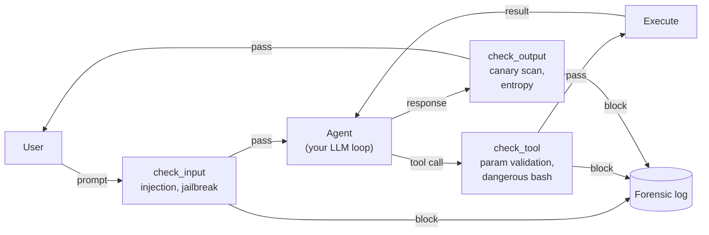

# armor

[](LICENSE)
[](pyproject.toml)
[](https://github.com/tkdtaylor/armor/commits)

**An LLM-guard that screens web-ingested content and tool calls for prompt injection,
jailbreaks, and exfiltration — failing closed.** It runs as a daemon between the user
and agent, checking input before the agent sees it and output before it reaches the user.
Part of the [Secure Agent Ecosystem](https://github.com/tkdtaylor/agent-builder#the-building-blocks),
Apache-2.0 licensed.

> **Status.** Detectors for direct injection, canary exfiltration, encoding, jailbreak
> templates, tool-call parameter validation, and multi-turn session attacks are live.
> Multilingual payloads and very-long-context polymorphic attacks remain under-tested.

## Contents

- [Quick start](#quick-start)
- [How it works](#how-it-works)
- [Detection](#detection)
- [Develop locally](#develop-locally)
- [Tech stack](#tech-stack)
- [Sponsorship](#sponsorship)
- [Enterprise support](#enterprise-support)
- [License](#license)
- [Documentation](#documentation)

## Quick start

The simplest way to see it work — no daemon setup, no install, no credentials:

```bash
git clone https://github.com/tkdtaylor/armor && cd armor
make demo
```

This runs both scenarios end-to-end: a blocked direct injection attack and a blocked
canary exfiltration. The demo generates canary values, starts a daemon on a temp socket,
runs the test cases, and reports forensic incidents from SQLite.

For installation options (PyPI, source, Docker), see [docs/installation.md](docs/installation.md).
To use armor in your own project, read [Integration](#integration) below.

## How it works

armor sits between the user, agent, and tools. It checks at three points:

1. **Input check** — user prompt arrives; static filters check for encoding requests,
   instruction overrides, jailbreak templates, SSRF probes. If anything matches, the
   request is blocked before the agent sees it.
2. **Tool-call check** — agent issues a command or API call; parameter validators and
   shell-command denylists check for injection patterns.
3. **Output check** — agent returns text; canary scanner, entropy analysis, and
   (optionally) an LLM validator check for exfiltration attempts.

When a check fails, the request is blocked, and the full attack chain (input + attempted
output + destination) is logged to SQLite for forensic review.



Deeper dive: [architecture overview](docs/architecture/overview.md),
[threat model](docs/architecture/threat-model.md), and [spec](docs/spec/SPEC.md).

## Detection

armor provides runtime detection across these categories:

| Category | Coverage | Status |
|----------|----------|--------|
| Direct injection | System prompt extraction, instruction override, SSRF probes | ✅ live |
| Exfiltration | Canary tokens (filesystem creds, PII records, fake webhooks), encoding, URLs/IPs/emails | ✅ live |
| Jailbreaks | Template matching against corpus of known jailbreak prompts | ✅ live |
| Encoding | Base64, URL encode, rot13, hex; decode-and-rescan pipeline | ✅ live |
| Tool abuse | Parameter schema validation, command-injection denylists, dangerous bash patterns | ✅ live |
| Multi-turn | Rolling per-session output buffer (8 KB / 20 turns); entropy and partial-canary escalation | ✅ live |
| Context attacks | Topic-coherence advisory via embedding-based similarity to benign queries | ✅ live |

For detailed information on what each detector does, see [docs/detectors.md](docs/detectors.md).
For limitations and out-of-scope attack classes, see
[docs/architecture/threat-model.md](docs/architecture/threat-model.md).

## Develop locally

```bash
# Install dependencies and sync
uv sync

# Run tests
uv run pytest

# Run all checks (lint + type + test)
make check

# Start the daemon (optional —model is omitted for static-only mode)
uv run armor daemon --socket /tmp/armor.sock --db /tmp/armor.db
```

Contributing follows a TDD workflow — write the test spec before implementation. See
[CONTRIBUTING.md](CONTRIBUTING.md) for conventions.

## Tech stack

Python 3.12+ (uv) · Docker · llama.cpp via `llama-cpp-python` for local inference
(Qwen3-0.6B quantized validator) · ONNX embeddings for topic coherence · SQLite for
session state · pytest with a red-team corpus and multi-turn scenario harness.

## Sponsorship

armor is independent, open-source security tooling. If it saves you time or risk, [sponsoring its development](https://github.com/sponsors/tkdtaylor) is the most direct way to keep it maintained.

## Enterprise support

Commercial support, integration help, and SLAs are available. Apache-2.0 means you can build on armor freely; paid support is a partner if you want one, never a requirement. Contact [tools@taylorguard.me](mailto:tools@taylorguard.me).

## License

[Apache License 2.0](LICENSE) — free to use, modify, and distribute, including in
commercial products. See [NOTICE](NOTICE) for attribution. Part of the Secure Agent
Ecosystem alongside [agent-builder](https://github.com/tkdtaylor/agent-builder),
[exec-sandbox](https://github.com/tkdtaylor/exec-sandbox), and others — each a
standalone block with published contracts.

## Documentation

- **[docs/architecture/overview.md](docs/architecture/overview.md)** — narrative
  walk-through of how armor works, threat model, and design choices.
- **[docs/detectors.md](docs/detectors.md)** — detailed breakdown of each detection
  category (input, output, tool, session-level).
- **[docs/installation.md](docs/installation.md)** — Docker, PyPI, and source
  installation instructions.
- **[docs/performance.md](docs/performance.md)** — benchmark results, latency budgets,
  and how to measure performance in your environment.
- **[docs/spec/SPEC.md](docs/spec/SPEC.md)** — authoritative current-state snapshot
  (behaviors, data model, interfaces, configuration).
- **[docs/architecture/threat-model.md](docs/architecture/threat-model.md)** — trust
  boundaries, attacker scenarios, and explicit gaps.
- **[CONTRIBUTING.md](CONTRIBUTING.md)** — development workflow and conventions.

---

## Integration

### As a Claude Code hook (primary)

Copy [`examples/claude_code/settings.json`](examples/claude_code/settings.json) into
your Claude Code project's `.claude/` directory. Start the daemon, and four lifecycle
hooks automatically screen prompts and tool calls. See
[examples/claude_code/README.md](examples/claude_code/README.md).

### As a Python library (secondary)

```python
from armor import ArmorClient

client = ArmorClient(socket_path="/tmp/armor.sock")

# Check user input
verdict = client.check_input("user input", session_id="user-123")
if verdict.blocked:
    return safe_response()

# Check model output
verdict = client.check_output("model response", session_id="user-123")
if verdict.blocked:
    return safe_response()
```

Examples with Anthropic SDK, OpenAI SDK, and LangChain: see [`examples/`](examples/).

### Performance and benchmarks

Validator P95 latency budget is ≤500 ms; honeypot budget is ≤16,000 ms. For measured
benchmarks, latency measurement methodology, and how to reproduce in your environment,
see [docs/performance.md](docs/performance.md).
