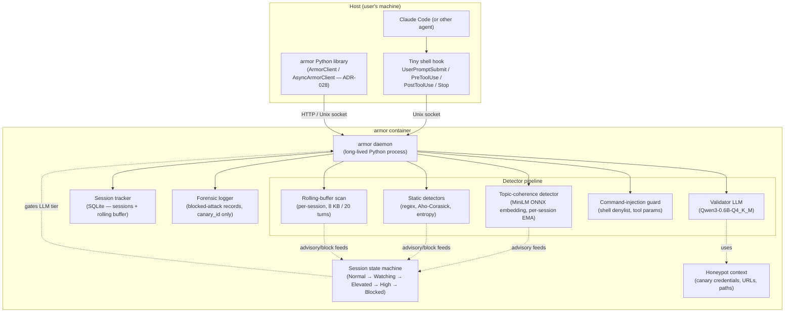
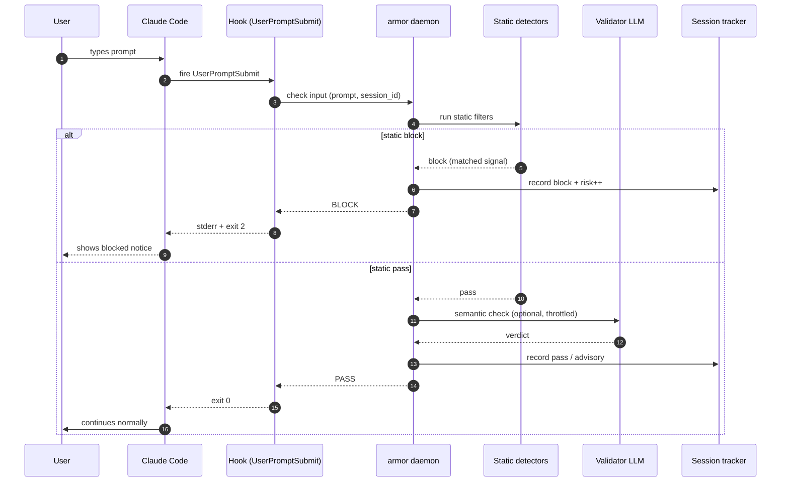
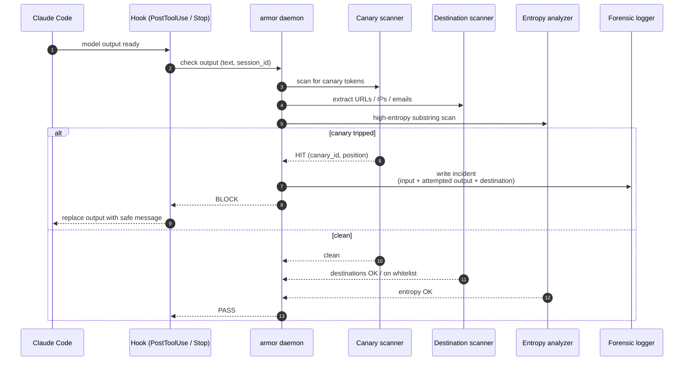
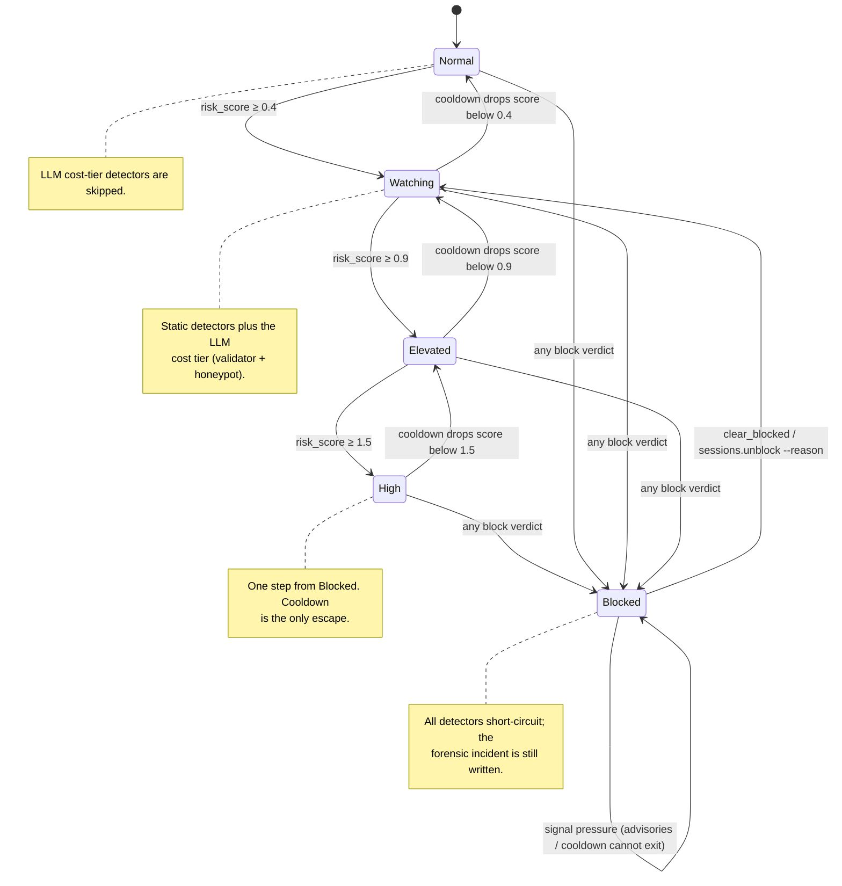

# Architecture Diagrams

**Project:** armor
**Last updated:** 2026-05-06 (v1.0 — operator-unblock CLI wired end-to-end, structured-log schema, SDK client wrapper)

Mermaid diagrams for the overall system and key runtime flows. See [overview.md](overview.md) for prose context and [decisions/](decisions/) for the ADRs referenced here.

These diagrams are part of the **authoritative spec** for this project. Code changes that contradict a diagram either invalidate the change or invalidate the diagram; one must be updated to match the other in the same commit.

---

## 1. System components



**Key contracts**
- The daemon is the single entry point; hooks and the library never invoke detectors directly. Keeps detector discovery, ordering, and config centralized.
- Every detector implements `Detector.check(payload, context) -> Verdict`. New detectors plug in via a registry; no detector touches another's internals.
- The validator LLM and the honeypot share one model weight; they differ only by system prompt. Loaded once at daemon start.
- The topic-coherence embedder loads `all-MiniLM-L6-v2` ONNX once at daemon start. The detector emits `advisory` only — never `block` on its own — and feeds the session state machine (ADR-026).
- The session state machine sits between the pipeline and per-detector cost decisions: it gates the LLM cost tier (skipped at `Normal`, run at ≥ `Watching`), accumulates risk from advisory verdicts, and short-circuits all detectors at `Blocked` while still writing the forensic incident (ADR-024).
- The rolling-buffer scan re-runs the canary scanner and entropy analyzer against the per-session concatenation on every output check; a chunked match that did not trip on a single turn produces `exfiltration.canary_chunked` with all turns currently in the buffer quarantined together (ADR-025).
- Session state is process-local (SQLite file in a mounted volume). A daemon restart preserves session history, FSM fields (`current_state`, `risk_score`, `last_signal_at`), and the rolling buffer.

---

## 2. Primary runtime flow — input check



---

## 3. Output / exfiltration check (canary trip)



---

## 4. Multi-turn risk escalation



Forward transitions are signal-driven: each `advisory` verdict adds `confidence × per-detector weight` to `risk_score`; any `block` verdict jumps directly to `Blocked` from any rung. Backward transitions are cooldown-driven: `risk_score` decays linearly at `session.cooldown_decay_per_min` against wall-clock time (default 0.1 / minute), and the state steps back exactly one rung when the score falls below the current rung's threshold. The operator-clear contract is `Blocked` → `Watching` via `armor sessions unblock <id> --reason <text>`; the daemon couples the state mutation with an `OperatorAuditLog` write in a single SQLite transaction (see §5 below). Thresholds and weights live in `armor.toml` (see [`docs/spec/configuration.md`](../spec/configuration.md)).

---

## 5. Operator-clear flow (sessions.unblock)

```mermaid
sequenceDiagram
    autonumber
    participant Op as Operator
    participant CLI as armor sessions unblock
    participant D as armor daemon
    participant FSM as state_machine.clear_blocked
    participant DB as SQLite (Session + OperatorAuditLog)
    participant Log as Structured logger

    Op->>CLI: armor sessions unblock SB --reason "manual review cleared"
    CLI->>D: IPC sessions.unblock (session_id, reason, actor)
    D->>FSM: clear_blocked(session_id, actor, reason, db_path)
    FSM->>DB: BEGIN; UPDATE Session SET current_state='Watching'; INSERT OperatorAuditLog; COMMIT
    alt session not Blocked
        FSM-->>D: raise InvalidStateTransition
        D->>Log: emit { event: "sessions.unblock", decision: "error" }
        D-->>CLI: { verdict: "error", message }
    else success
        FSM-->>D: SessionState.WATCHING
        D->>Log: emit { event: "sessions.unblock", decision: "pass", session_id }
        D-->>CLI: { verdict: "pass", new_state: "Watching" }
    end
```

This flow is the only exit from `Blocked`. The state mutation and the
audit-log row are written under a single SQLite transaction; if either
fails the session remains `Blocked` and no audit row is written
(enforced by the unit test in `tests/unit/test_clear_blocked.py`).

---

## Adding more diagrams

Add additional numbered sections (5., 6., …) for any of:

- Tool-call validation flow (when the command-injection guard tells more nuanced detail)
- Deployment topology (host hook → container socket → daemon → SQLite volume)
- Canary value generation (how marker patterns get embedded into "valid-looking" credentials)

One concept per diagram. If a diagram tries to show both a component layout and a runtime sequence, split it.

---

## Maintaining these diagrams

- **Trigger to update:** any time a new detector class lands, the daemon's IPC surface changes, or session-state semantics change.
- **Edit existing over adding new.** Duplicates rot independently.
- **Update the date at the top** when you change anything substantive.
