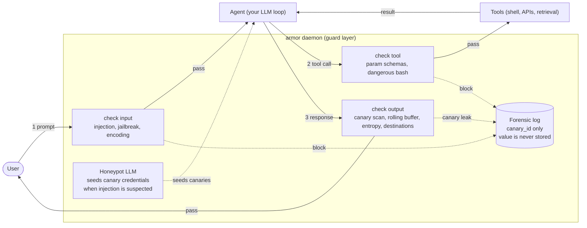
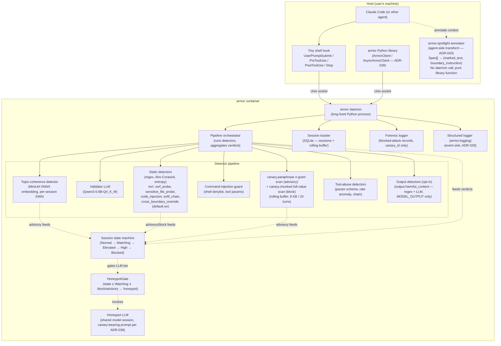
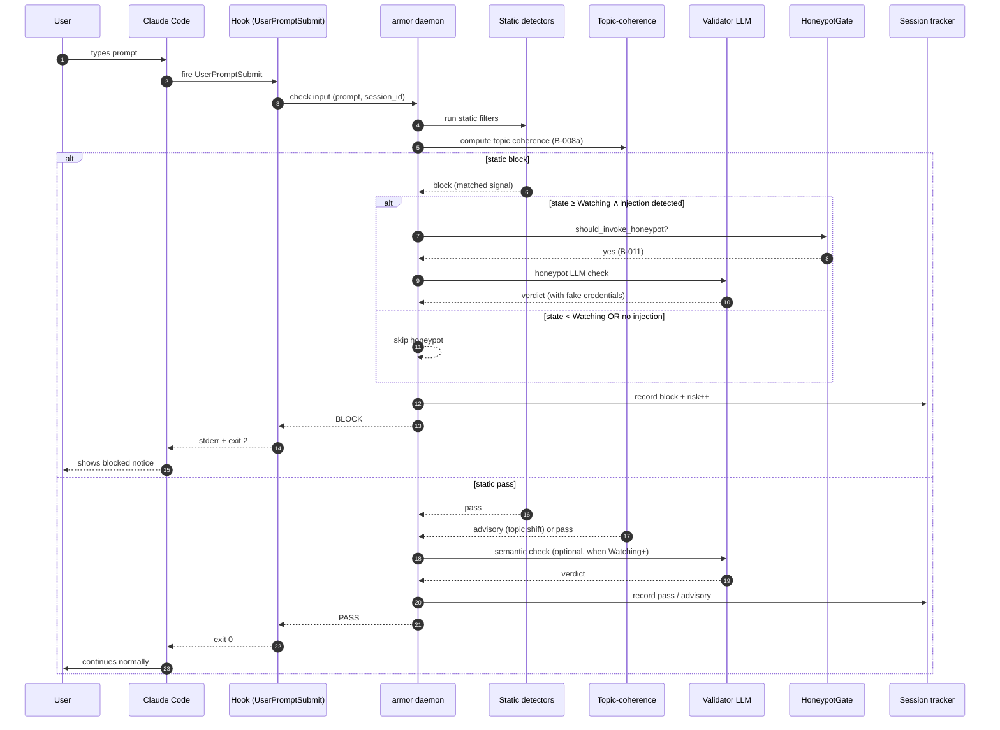
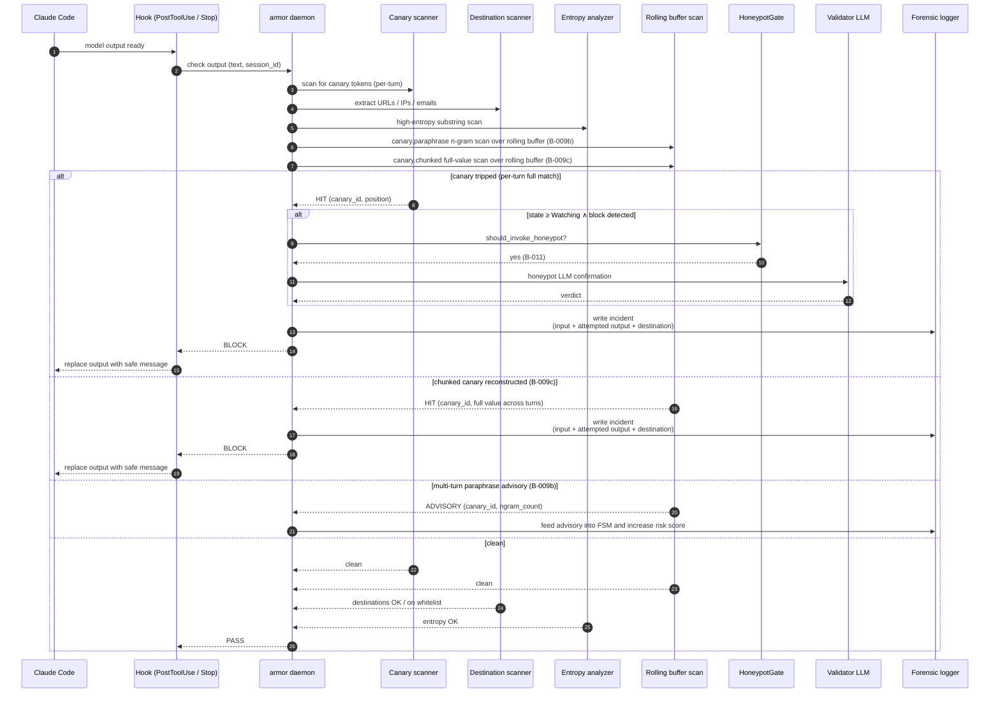
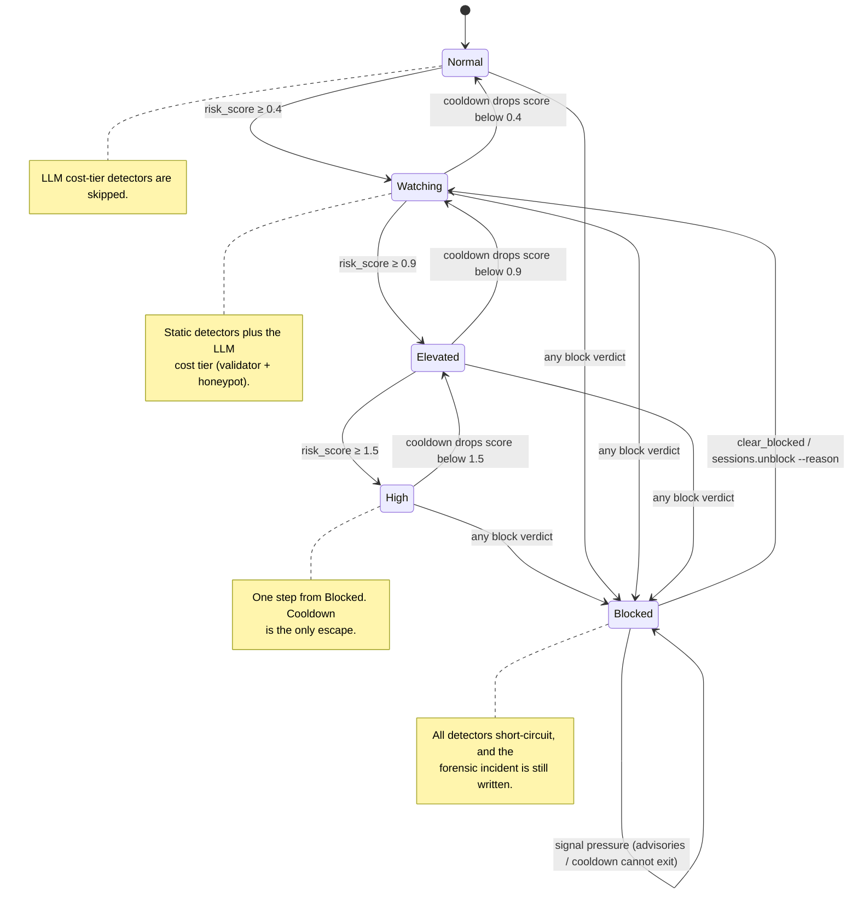
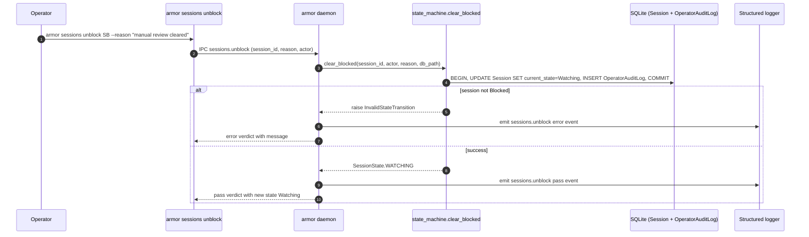
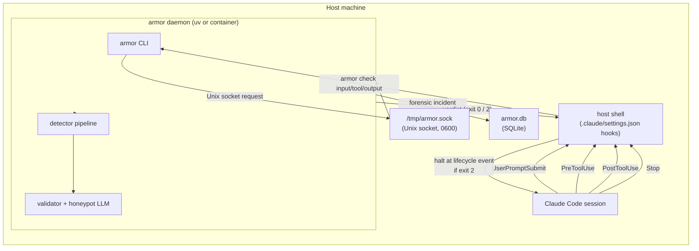
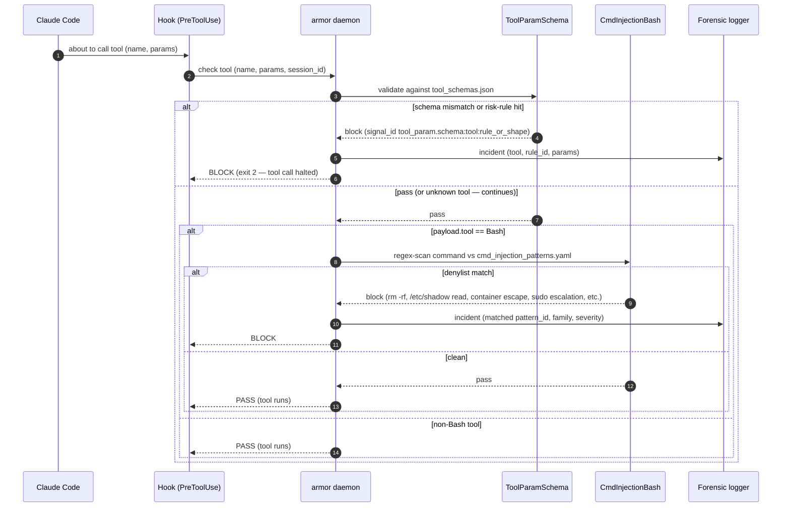
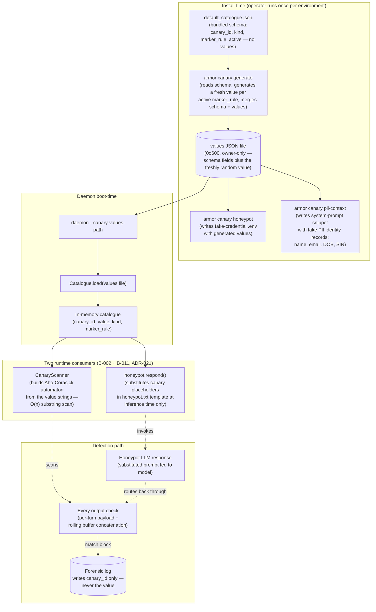

# Architecture Diagrams

**Project:** armor
**Last updated:** 2026-06-19 (v2.3 — drift fix: documented canary.chunked block path (B-009c) and cross_boundary_override in §1 and §3)

Mermaid diagrams for the overall system and key runtime flows. See [overview.md](overview.md) for prose context and [decisions/](decisions/) for the ADRs referenced here.

These diagrams are part of the **authoritative spec** for this project. Code changes that contradict a diagram either invalidate the change or invalidate the diagram; one must be updated to match the other in the same commit.

---

## Capability overview — armor protecting an agent

The 30-second mental model. armor sits as a guard layer between the user, the agent's LLM loop, and the tools the agent calls. It enforces three intercept points (input, tool, output) and runs a canary-trap path: a honeypot LLM seeds fake credentials into suspicious sessions, and if any of those credentials reappear in a later output the request is blocked and a forensic incident is written — with the `canary_id` only, never the value.

**Reading the diagram**

- **Solid arrows** are the happy path (the request flows through). **Dotted arrows** are the unhappy path (a check fired, the request is blocked, the incident is written to the forensic log).
- **Three intercept points** map to the three `armor check` subcommands. They are wired through four Claude Code lifecycle hooks (`UserPromptSubmit`, `PreToolUse`, `PostToolUse`, `Stop` — see §6 for the deployment topology). Every detector runs at exactly one point — there's no shared mutable state between them.
- **The canary trap** is the loop on the right: the honeypot LLM (same model weights as the validator, different system prompt) seeds canary credentials into the agent's context when a session reaches `Watching` and an injection signal fires. Any later output containing one of those values trips the canary scanner at the output check. The honeypot is not a detector — it's a bait generator that makes exfiltration *visible* downstream.
- **Forensic log discipline.** The forensic log records `canary_id` (e.g. `aws-key-042`) and not the canary value. Two reasons: (1) the log itself must not become an exfiltration channel if an attacker ever gains read access to it, and (2) canary values are expected to be regenerated and rotated; pinning a value into the audit history would couple the audit trail to a transient secret. See ADR-010 for the storage contract and the unit test that enforces it.

The eight diagrams below zoom into individual aspects of this overview: §1 component layout, §2 input flow, §3 output / canary-trip flow, §4 multi-turn risk escalation, §5 operator-clear path, §6 Claude Code deployment topology, §7 tool-call validation flow, §8 canary value generation and runtime use.

---

## 1. System components

**Key contracts**
- The daemon is the single entry point; hooks and the library (armor.sdk, armor.canaries) never invoke detectors directly. Keeps detector discovery, ordering, and config centralized.
- The pipeline orchestrator (`armor.pipeline.Pipeline`) is the composition engine: it runs detectors in sequence, enforces per-detector timeouts, and aggregates verdicts (first block short-circuits, otherwise highest-severity advisory propagates).
- Every detector implements `Detector.check(payload, context) -> Verdict`. New detectors plug in via a registry; no detector touches another's internals.
- The HoneypotGate (`armor.daemon.honeypot_gate.should_invoke_honeypot`) gates the honeypot path: invoked only when session state ≥ `Watching` AND the static pipeline returns `block` or `advisory` (per B-011).
- The validator LLM and the honeypot share one model weight; they differ only by system prompt. Loaded once at daemon start.
- The topic-coherence embedder (`armor.embeddings.onnx_embedder.Embedder`) loads `all-MiniLM-L6-v2` ONNX once at daemon start; the detector maintains a rolling EMA via `armor.embeddings.ema_cache.EMACache`. The detector emits `advisory` only — never `block` on its own — and feeds the session state machine (ADR-026). Input checks run the topic-coherence detector per B-008a.
- The session state machine sits between the pipeline and per-detector cost decisions: it gates the LLM cost tier (skipped at `Normal`, run at ≥ `Watching`), accumulates risk from advisory verdicts, and short-circuits all detectors at `Blocked` while still writing the forensic incident (ADR-024).
- The rolling buffer (per-session concatenation, 8 KB / 20 turns per ADR-025) is consumed by two detectors: `detectors.canary_paraphrase` scans for ≥ K distinct n-grams of any active canary and emits an `advisory` (per B-009a / B-009b), and `detectors.canary_chunked` scans the concatenated buffer for a complete canary value reconstructed across turns and emits `block` on a full match (per B-009c).
- The canaries module (`armor.canaries.catalogue.Catalogue`, `armor.canaries._generate.write_values_file`) manages the injected credential catalogue — placeholders are substituted at honeypot LLM prompt-build time.
- The structured logger (`armor.logging`) is the event sink for all daemon operations: verdicts, state transitions, honeypot invocations, and forensic incidents. Event schema is defined in ADR-029.
- The SDK (`armor.sdk.client.ArmorClient`, `armor.sdk.async_client.AsyncArmorClient`) provides importable clients for third-party integrations; daemon communication is via Unix socket, never in-process.
- Session state is process-local (SQLite file in a mounted volume). A daemon restart preserves session history, FSM fields (`current_state`, `risk_score`, `last_signal_at`), and the rolling buffer.
- The `armor.spotlight` annotator (`armor.spotlight.annotate`) is a pure library transform that runs in the **agent process**, not inside the daemon container. It accepts a list of `Span` objects (each tagged with a `Source` provenance label) and returns `(marked_text, boundary_instruction)`. The agent prepends `boundary_instruction` to its system prompt and passes `marked_text` as context to the downstream LLM. This transform has no daemon call, no network call, and does not touch the detector pipeline — it is a standalone ADR-028 stable SDK surface (ADR-043 §2). Detection of sentinel forgery in untrusted spans is the annotator's secondary role: if an untrusted span's text contains the sentinel base string, the annotator neutralizes it and raises `SentinelForgeryError` so the agent can log the boundary-escape attempt.

---

## 2. Primary runtime flow — input check

---

## 3. Output / exfiltration check (canary trip)

---

## 4. Multi-turn risk escalation

Forward transitions are signal-driven: each `advisory` verdict adds `confidence × per-detector weight` to `risk_score`; any `block` verdict jumps directly to `Blocked` from any rung. Backward transitions are cooldown-driven: `risk_score` decays linearly at `session.cooldown_decay_per_min` against wall-clock time (default 0.1 / minute), and the state steps back exactly one rung when the score falls below the current rung's threshold. The operator-clear contract is `Blocked` → `Watching` via `armor sessions unblock <id> --reason <text>`; the daemon couples the state mutation with an `OperatorAuditLog` write in a single SQLite transaction (see §5 below). Thresholds and weights live in `armor.toml` (see [`docs/spec/configuration.md`](../spec/configuration.md)).

---

## 5. Operator-clear flow (sessions.unblock)

This flow is the only exit from `Blocked`. The state mutation and the
audit-log row are written under a single SQLite transaction; if either
fails the session remains `Blocked` and no audit row is written
(enforced by the unit test in `tests/unit/test_clear_blocked.py`).

---

## 6. Deployment topology — Claude Code hook integration

The most common public deployment shape: a Claude Code project on the host calls `armor check <kind>` from each lifecycle hook; the daemon runs in the same host (uv) or in a container.

Wire-up reference: [examples/claude_code/settings.json](../../examples/claude_code/settings.json) is the drop-in `.claude/settings.json` that establishes this topology. The Python SDK path (`examples/anthropic_sdk.py`, `examples/openai_sdk.py`, `examples/langchain.py`, `examples/custom_agent.py`) bypasses the hook layer and calls the daemon directly via `ArmorClient`; the topology is otherwise the same.

The four lifecycle hooks map to four armor check kinds plus session bookkeeping. `PostToolUse` is wired twice with different tool-name matchers — read-style tools (Read/WebFetch/Grep/Glob/MCP-readers) feed `check fetched` for indirect-injection scanning, all other tool results feed `check output` for canary-leak detection:

| Lifecycle event | Tool matcher | armor command | Defends against |
|---|---|---|---|
| `UserPromptSubmit` | (any) | `armor check input` | direct injection, jailbreak templates, encoding-request patterns |
| `PreToolUse` | (any) | `armor check tool` | parameter tampering, dangerous bash, schema violations |
| `PostToolUse` | `Read\|WebFetch\|Grep\|Glob\|mcp__.*__read.*` | `armor check fetched` | indirect injection in retrieved content (B-017) |
| `PostToolUse` | (any) | `armor check output` | canary exfiltration, encoded payloads, partial-canary aggregation |
| `Stop` | — | `armor session close` | per-session state flush (rolling buffer, risk score) |

---

## 7. Tool-call validation flow

The `armor check tool` path (PreToolUse hook). Two static detectors compose: `tool_param_schema.ToolParamSchema` always runs (looks the tool up in `tool_schemas.json`, validates parameter shape, then runs each declared `risk_rule`); `cmd_injection_bash.CmdInjectionBash` runs only when `payload.tool == "Bash"` and matches the bash command string against the patterns in `cmd_injection_patterns.yaml`. The pipeline short-circuits on the first `block`.

**Key contracts**

- `ToolParamSchema.check` returns `pass` with `details.unknown_tool=true` when the tool name is absent from the registry. The pipeline does not block on unknown tools — it relies on subsequent detectors (today only `CmdInjectionBash` for Bash) to decide.
- A schema mismatch (missing required param, wrong type) emits `signal_id = tool_param.schema:<tool>:shape`. A `risk_rule` match emits `signal_id = tool_param.schema:<tool>:<rule.id>`. Both are `severity: "high"` and short-circuit the pipeline.
- `CmdInjectionBash._patterns` is loaded once per process (class-level cache). Patterns are categorized by `family` (`filesystem_destruction`, `credential_read`, `container_escape`, `privilege_escalation`); the family becomes part of the forensic incident category.
- The detector for tool calls runs the same orchestration shape as input/output checks — see §1's `Pipeline orchestrator` and the `_handle_check_operation` dispatch in `armor/daemon/server.py`. The only difference is the payload constructor (`Payload(text=f"{tool} {params}", tool=tool, params=params)`).

---

## 8. Canary value generation and runtime use

How a canary value gets from "regex pattern in the bundled schema" to "Aho-Corasick automaton + substituted honeypot prompt" without ever touching the GGUF model file. Three phases: install, boot, runtime.

**Key contracts**

- The bundled `default_catalogue.json` ships in the wheel and the Docker image but contains **no values** — only `canary_id`, `kind`, `service`, `marker_rule`, `active`. Anyone reading the public source learns the *shape* of the canaries, not any deployment's specific values.
- Two honeypot output paths are available after `armor canary generate`: `armor canary honeypot` writes a fake-credential `.env` file (credentials surface) and `armor canary pii-context` writes a system-prompt snippet with fake PII identity records (name, email, date of birth, SIN). Both output files contain real canary values registered in the daemon; any output containing these values triggers a block via the Aho-Corasick scanner — regardless of how the attacker phrased their request.
- `_generate_value_for_pattern(marker_rule)` in `armor/canaries/_generate.py` knows the recognized regex shapes (AWS keys, GitHub PATs, Stripe keys, fake URLs/paths/hostnames/emails, fake wallet addresses) and emits a fresh random string conforming to each. Unknown patterns raise `ValueError` rather than silently producing garbage.
- `write_values_file()` writes the merged schema + values atomically with mode `0o600` via `os.open(O_CREAT|O_WRONLY|O_TRUNC, 0o600)` — readable only by the owning user. Each install therefore has a different value set; cloning a public dump tells an attacker nothing about a target deployment.
- The `Catalogue` object is daemon-process-local. There is no network read; the values file path is operator-controlled and lives outside the Docker image (per ADR-010).
- `CanaryScanner` builds its automaton once at daemon start from the in-memory values. Substring matching is O(n) in the input length regardless of catalogue size, which keeps the per-output cost flat.
- `armor.llm.honeypot.respond` is the *only* code path that reads `Catalogue.value`. The validator path never touches values — enforced by the `tests/fitness/test_validator_no_value_access.py` fitness function that AST-scans `validator.py` for any `catalogue.values()` call or `.value` field access (per ADR-021).
- The forensic log records `triggered_canary = canary_id` (e.g. `aws-key-042`), not the value. Test `test_triggered_canary_id_not_value` in `tests/unit/db/test_forensic.py` asserts the substitution at write time; the log itself can never become an exfiltration channel.
- A successful injection that causes the honeypot LLM to emit its substituted prompt content routes back through the same output-check path (because every honeypot response is itself an output) — closing the loop deterministically: prompt-injection → honeypot bait → canary value in output → Aho-Corasick match → block + forensic incident.

---

## Adding more diagrams

Reserved for future expansion. The current open candidate is:

- Container-only topology (defer until the GHCR image is published — same shape as §6 with `Daemon` running in its own container reachable via shared-volume socket)

If a new component lands or an existing flow gains a non-obvious branch, add it as the next numbered section. One concept per diagram. If a diagram tries to show both a component layout and a runtime sequence, split it.

---

## Maintaining these diagrams

- **Trigger to update:** any time a new detector class lands, the daemon's IPC surface changes, or session-state semantics change.
- **Edit existing over adding new.** Duplicates rot independently.
- **Update the date at the top** when you change anything substantive.
