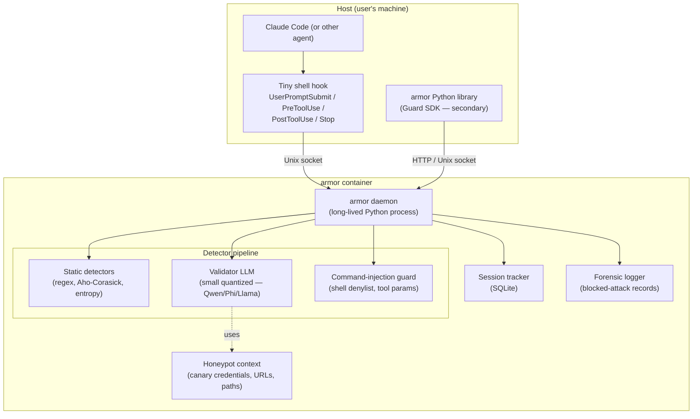
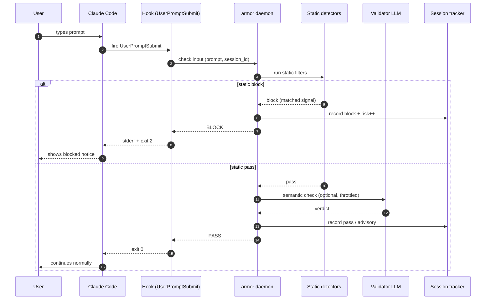
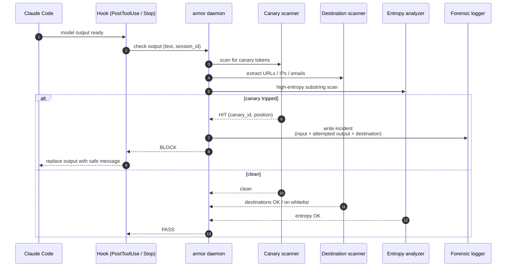
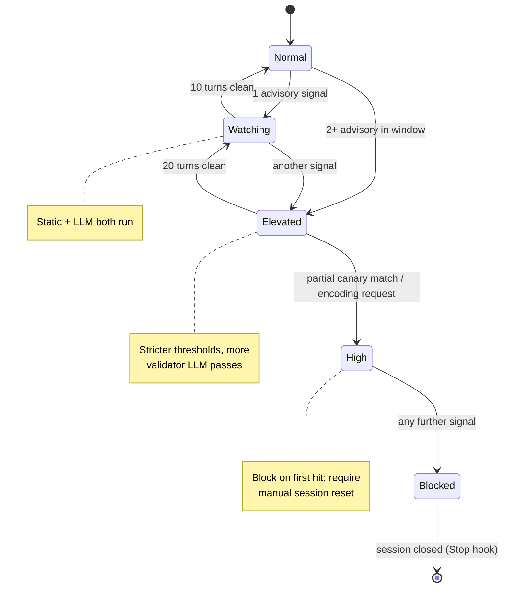

# Architecture Diagrams

**Project:** armor
**Last updated:** 2026-05-05

Mermaid diagrams for the overall system and key runtime flows. See [overview.md](overview.md) for prose context and [decisions/](decisions/) for the ADRs referenced here.

These diagrams are part of the **authoritative spec** for this project. Code changes that contradict a diagram either invalidate the change or invalidate the diagram; one must be updated to match the other in the same commit.

---

## 1. System components

**Key contracts**
- The daemon is the single entry point; hooks and the library never invoke detectors directly. Keeps detector discovery, ordering, and config centralized.
- Every detector implements `Detector.check(payload, context) -> Verdict`. New detectors plug in via a registry; no detector touches another's internals.
- The validator LLM and the honeypot share one model weight; they differ only by system prompt. Loaded once at daemon start.
- Session state is process-local (SQLite file in a mounted volume). A daemon restart preserves session history.

---

## 2. Primary runtime flow — input check

---

## 3. Output / exfiltration check (canary trip)

---

## 4. Multi-turn risk escalation

---

## Adding more diagrams

Add additional numbered sections (5., 6., …) for any of:

- Tool-call validation flow (when the command-injection guard tells more nuanced detail)
- Deployment topology (host hook → container socket → daemon → SQLite volume)
- Canary value generation (how marker patterns get embedded into "valid-looking" credentials)

One concept per diagram. If a diagram tries to show both a component layout and a runtime sequence, split it.

---

## Maintaining these diagrams

- **Trigger to update:** any time a new detector class lands, the daemon's IPC surface changes, or session-state semantics change.
- **Edit existing over adding new.** Duplicates rot independently.
- **Update the date at the top** when you change anything substantive.
